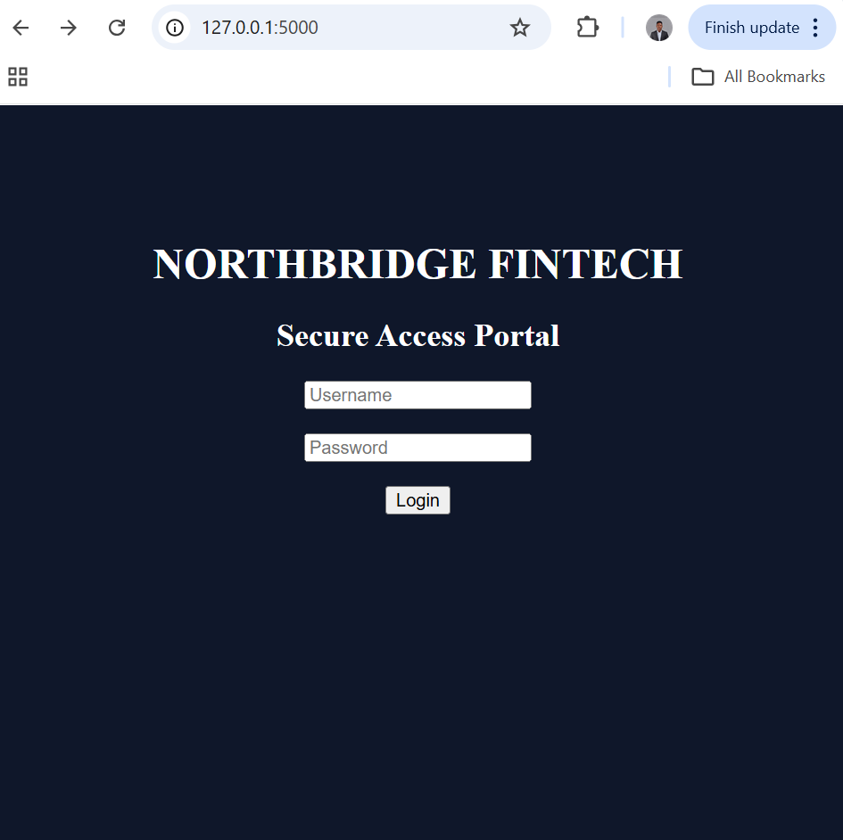
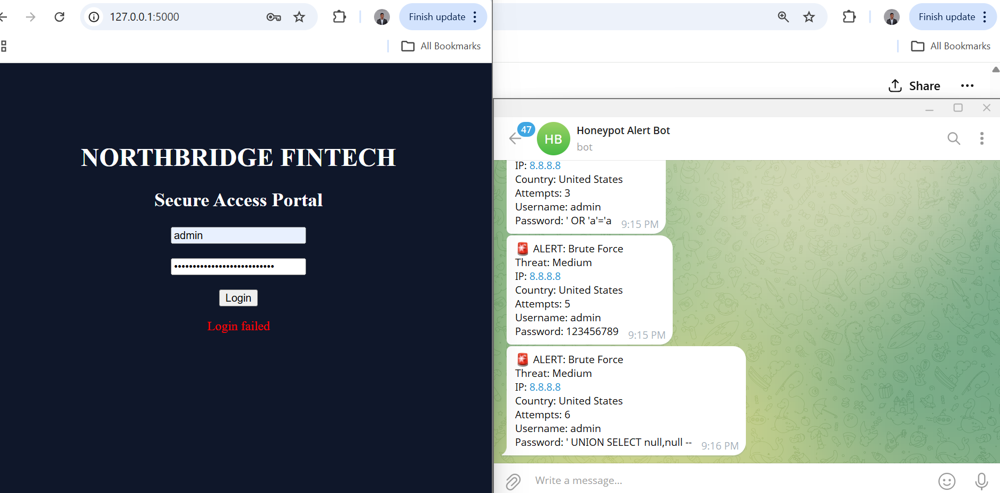

# 🚨 Northbridge Fintech Honeypot

A Python-based web honeypot that simulates a secure login portal to detect, log, and analyze malicious activities such as SQL Injection and Brute Force attacks in real time.

---

## 🔍 Features

* SQL Injection detection (e.g. `' OR 1=1 --`, `UNION SELECT`)
* Brute-force attack detection based on repeated login attempts
* Real-time Telegram alerts with full attack details
* Attack logging (IP, username, password payload, threat level)
* GeoIP enrichment (demo mode using 8.8.8.8)
* Interactive dashboard with charts (Chart.js)

---

## 🧠 How It Works

The application mimics a legitimate login portal to attract potential attackers.
All login attempts are captured and analyzed in real time.

Suspicious inputs are:

* Classified as attacks (SQL Injection / Brute Force)
* Logged into a JSON file
* Sent as real-time alerts via Telegram

---

## 📸 Demo

<video src="your-video-file.mp4" controls width="600"></video>

> ⚠️ If video does not display on GitHub, view it directly in the repository.

---

## 📸 Screenshots

### 🔐 Login Portal



### 🚨 Telegram Alert



---

## 📊 Dashboard

Access the dashboard at:

http://127.0.0.1:5000/dashboard

Displays:

* SQL Injection vs Brute Force attacks
* Threat level distribution
* Logged attack activity

---

## ⚙️ Setup

### 1. Clone repository

```bash
git clone https://github.com/Danielnwachukwu/northbridge-honeypot.git
cd northbridge-honeypot
```

### 2. Install dependencies

```bash
pip install flask requests python-dotenv
```

### 3. Create `.env`

```bash
TELEGRAM_TOKEN=your_token_here
```

### 4. Run the app

```bash
python app.py
```

---

## 📲 Example Alert

🚨 ALERT: SQL Injection
Threat: High
IP: 8.8.8.8
Country: United States
Attempts: 1
Username: admin
Password: ' OR 1=1 --

---

## ⚠️ Disclaimer

This project is for educational and defensive cybersecurity purposes only.
Do not deploy on public networks without proper authorization.

---

## 🛠️ Tech Stack

* Python (Flask)
* JavaScript (Chart.js)
* Telegram Bot API

---

## 👨‍💻 Author

Daniel Nwachukwu
